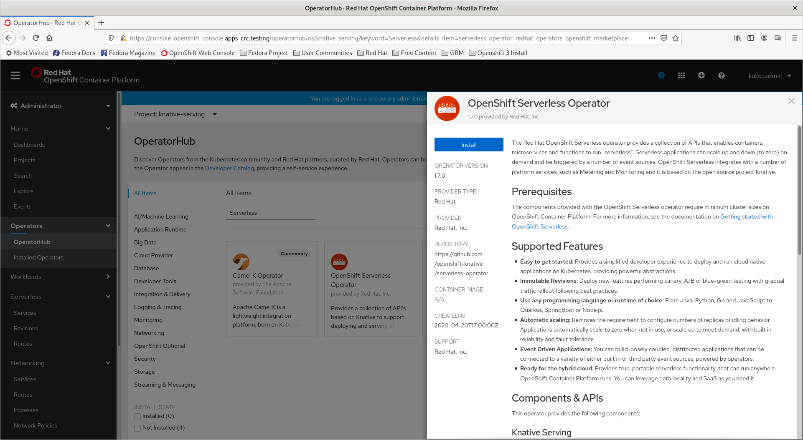

# Configuración

## Openshift
1. Ingresamos a la consola web de openshift.
2. Ingresamos a `Operators > OperatorHub`
3. Ubicamos el Operador `Openshift Serverless Operator` y procedemos a instalar el mismo
   
4. Elegir en `Update Channel` con versión `x.x` y dejar lo demás predeterminado, para proceder con la suscripción del operador.

## Kubernetes
Lorem ipsum dolor sit amet, consectetur adipiscing elit. Donec tempor tortor quis hendrerit lobortis. Pellentesque ullamcorper turpis sapien, at scelerisque mi condimentum quis. Quisque elit nisi, vulputate ut sapien et, sodales congue nibh. Proin pulvinar lobortis venenatis. Etiam bibendum risus vitae odio elementum, sit amet tincidunt arcu interdum. Sed in pellentesque nunc, eu feugiat ante. Etiam suscipit erat sit amet felis commodo, in sollicitudin sem semper. Pellentesque commodo, neque ac congue commodo, urna ante venenatis erat, vel molestie leo eros non elit. Sed blandit sodales enim quis pulvinar. Praesent nec vestibulum ipsum. In ante eros, dignissim sed risus eget, molestie volutpat erat. Etiam posuere ante mauris, sit amet fermentum nisi consequat ut. Nam augue lectus, gravida a sapien ut, fermentum varius dui. Lorem ipsum dolor sit amet, consectetur adipiscing elit. Quisque vitae erat eu lacus convallis fermentum. 