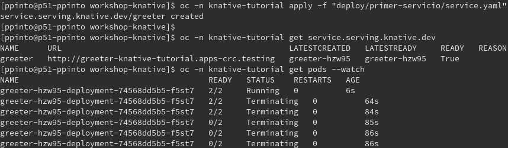
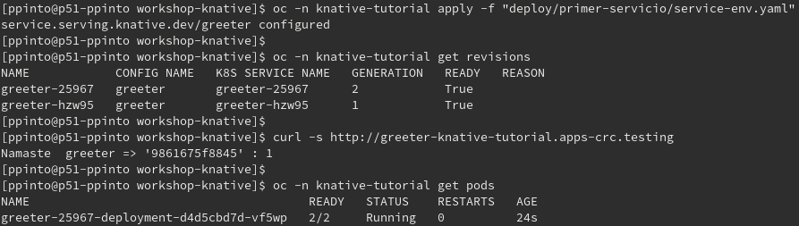

# Knative Serving - Primer Servicio

## Despliegue
Vamos a proceder a crear nuestro primer servicio en Knative. El servicio en cuestión utilizara un contenedor cuya función es dar una respuesta HTTP y un conteo de las peticiones que ha atendido.

[`service.yaml`](deploy/primer-servicio/service.yaml)
```yaml
apiVersion: serving.knative.dev/v1
kind: Service
metadata:
  name: greeter
spec:
  template:
    spec:
      containers:
      - image: quay.io/rhdevelopers/knative-tutorial-greeter:quarkus
        livenessProbe:
          httpGet:
            path: /healthz
        readinessProbe:
          httpGet:
            path: /healthz
   ```

Procedemos a crear el mismo con:

*Openshift*
```console
oc apply -n knative-tutorial -f "deploy/primer-servicio/service.yaml"
```

*Kubernetes*
```console
kubectl apply -n knative-tutorial -f "deploy/primer-servicio/service.yaml"
```

Podemos validar el servicio desplegado con los siguientes comandos:

*Openshift*
```console
oc get -n knative-tutorial service.serving.knative.dev
oc get -n knative-tutorial pods --watch
```
*Kubernetes*
```console
kubectl get -n knative-tutorial service.serving.knative.dev
kubectl get -n knative-tutorial pods --watch
```
> *Debido a que se está pasando la bandera `--watch` el cliente correspondiente se mantendrá esperando actualizaciones de estado. Este paso se hace con la intención de observar que al no recibir peticiones, los `pods` creados con el servicio serán terminados. Una vez esto ocurra, se puede cancelar el modo de espera con `Ctrl+C`*



>También es posible sustituir el nombre `service.serving.knative.dev` por `ksvc` o `kservice` que son las abreviaciones para el tipo de recurso.

## Invocación
Si nos mantuvimos esperando que los `pods` terminasen en el paso anterior, en este momento no debe haber quien atienda las peticiones. No obstante, debido a que sigue existiendo la definición del servicio (`kservice` en adelante) es posible realizar peticiones al mismo. 

Para poder invocar el `kservice`, primero obtenemos el `URL` mediante el cuál invocar el mismo, en la salida del siguiente comando:

*Openshift*
```console
oc get -n knative-tutorial kservice greeter
```
*Kubernetes*
```console
kubectl get -n knative-tutorial kservice greeter
```

Para activar el servicio, basta con hacerle una petición al mismo, para lo cuál utilizaremos el siguiente comando:

*Linux y MacOS*
```console
curl -s [URL] 
```
*Powershell*
*Linux y MacOS*
```console
Invoke-WebRequest [URL]
```

Si validamos a este punto los `pods`, deberíamos observar que nuevamente existe un pod para atender las peticiones:

*Openshift*
```console
oc get -n knative-tutorial pods
```
*Kubernetes*
```console
kubectl get -n knative-tutorial pods
```


## Validación de recursos
Con la creación del `kservice` se crearan otros recursos de knative. Podemos validar los mismos con los siguientes comandos:

### Services (`kservice` o `ksvc`)
*Openshift*
```console
oc -n knative-tutorial get services.serving.knative.dev
```
*Kubernetes*
```console
kubectl -n knative-tutorial get services.serving.knative.dev
```

### Configurations (`cfg`)
*Openshift*
```console
oc -n knative-tutorial get configurations.serving.knative.dev
```
*Kubernetes*
```console
kubectl -n knative-tutorial get configurations.serving.knative.dev
```

### Routes (`rt`)
*Openshift*
```console
oc -n knative-tutorial get routes.serving.knative.dev
```
*Kubernetes*
```console
kubectl -n knative-tutorial get routes.serving.knative.dev
```

### Revisions (`rev`)
*Openshift*
```console
oc -n knative-tutorial get revisions.serving.knative.dev
```
*Kubernetes*
```console
kubectl -n knative-tutorial get revisions.serving.knative.dev
```

>Se ha incluido entre parentesís la abreviación para los diferentes recursos. Estos pueden ser incluidos en lugar del nombre en formato `*.serving.knative.dev`, siempre que no hagan colisión con algún otro tipo de recurso primitivo o *Custom Resource Definition (`CRD`)* existente en el entorno.


## Actualización

Múltiples motivos pueden influir en la necesidad de ejecutar actualización sobre nuestros servicios, como por ejemplo: cambios en la configuración(parametrización) o en la lógica de los mismos(nuevas versiones). 

El siguiente ejemplo incluye cambios en la parametrización del servicio existente, tal como se describe a continuación:

[`service-env.yaml`](deploy/primer-servicio/service-env.yaml)
```yaml
apiVersion: serving.knative.dev/v1
kind: Service
metadata:
  name: greeter
spec:
  template:
    spec:
      containers:
      - image: quay.io/rhdevelopers/knative-tutorial-greeter:quarkus
        env:
        - name: MESSAGE_PREFIX
          value: Namaste
        livenessProbe:
          httpGet:
            path: /healthz
        readinessProbe:
          httpGet:
            path: /healthz
```
Procedemos a crear el mismo con:

*Openshift*
```console
oc apply -n knative-tutorial -f "deploy/primer-servicio/service-env.yaml"
```

*Kubernetes*
```console
kubectl apply -n knative-tutorial -f "deploy/primer-servicio/service-env.yaml"
```

Una vez aplicado el mismo, podemos validar que obtendremos ahora 2 `revisions` distintas al usar el comando 
*Openshift*
```console
oc -n knative-tutorial get revisions
```

*Kubernetes*
```console
kubectl -n knative-tutorial get revisions"
```

Si [invocamos](#invocación) el servicio nuevamente, el mismo enviara una respuesta un tanto distinta en el saludo



>En este punto, hemos logrado actualizar el servicio y hacer que el mismo responda tomando en cuenta nuevos parámetros de configuración. 

## Limpieza
Limpiamos el entorno con el siguiente comando:

*Openshift*
```console
oc -n knative-tutorial delete -f deploy/primer-servicio/
```

*Kubernetes*
```console
kubectl -n knative-tutorial delete -f deploy/primer-servicio/
```