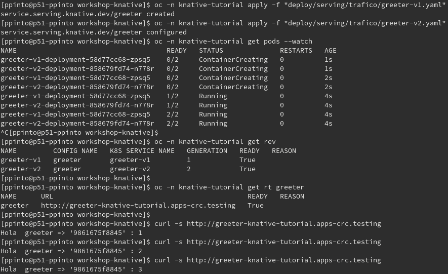
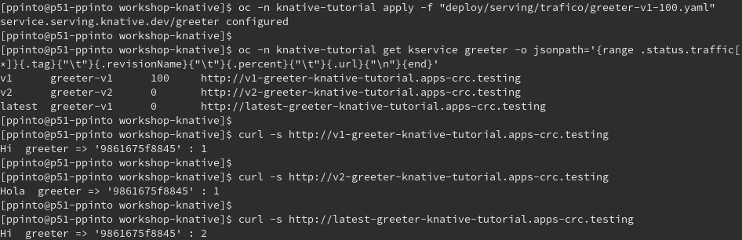
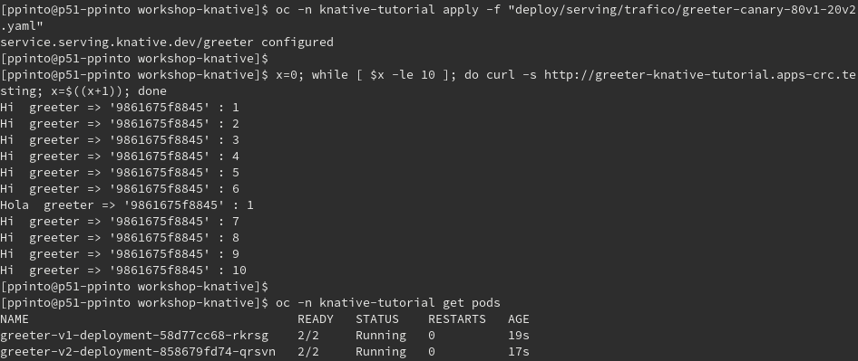

# Knative Serving - Manejo de Trafico

## Introducción
Durante está actividad, ejecutaremos tareas que nos daran la capacidad de:
- Desplegar múltiples revisiones de un mismo servicio. 
- Configurar el trafico de peticiones entre diferentes revisiones del servicio. 
- Acceder a las *sub-rutas* generadas por revisión de un servicio.
- Probar *Blue-Green Deployments*
- Probar *Canary Deployments*

## Control de nombre de revisiones
Por defecto, Knative genera los nombres para las revisiones, basados en el nombre del servicio. Debido a que para el control de tráfico entre revisiones, es requerido utilizar el nombre de las mismas, en está sección veremos como generar nombres especificos de revisiones. 

La siguiente definición logra lo anterior, por medio del contenido dela variable `.spec.template.metadata.name`, como se observa a continuación:

[greeter-v1.yaml](../../deploy/serving/trafico/greeter-v1.yaml)
```yaml
apiVersion: serving.knative.dev/v1
kind: Service
metadata:
  name: greeter
spec:
  template:
    metadata:
      name: greeter-v1
    spec:
      containers:
        - image: quay.io/rhdevelopers/knative-tutorial-greeter:quarkus
          livenessProbe:
            httpGet:
              path: /healthz
          readinessProbe:
            httpGet:
              path: /healthz
```
De igual manera, para el presente ejercicio vamos a desplegar también una segunda versión del mismo, con fines que serán descritos posteriormente:

[greeter-v2.yaml](../../deploy/serving/trafico/greeter-v2.yaml)
```yaml
apiVersion: serving.knative.dev/v1
kind: Service
metadata:
  name: greeter
spec:
  template:
    metadata:
      name: greeter-v2
    spec:
      containers:
        - image: quay.io/rhdevelopers/knative-tutorial-greeter:quarkus
          env:
            - name: MESSAGE_PREFIX
              value: Hola
          livenessProbe:
            httpGet:
              path: /healthz
          readinessProbe:
            httpGet:
              path: /healthz
```

Procedemos entonces a crear ambos con los siguientes comandos:

*Openshift*
```console
oc -n knative-tutorial apply -f "deploy/serving/trafico/greeter-v1.yaml"
oc -n knative-tutorial apply -f "deploy/serving/trafico/greeter-v2.yaml"
oc -n knative-tutorial get pods --watch
```

*Kubernetes*
```console
kubectl -n knative-tutorial apply -f "deploy/serving/trafico/greeter-v1.yaml"
kubectl -n knative-tutorial apply -f "deploy/serving/trafico/greeter-v1.yaml"
kubectl -n knative-tutorial get pods --watch
```

>*Esperamos que los pod's estén disponibles y cancelamos con `Control+C`.

Una vez creados, podemos validar las diferentes revisiones con el comando:

*Openshift*
```console
oc -n knative-tutorial get rev
```

*Kubernetes*
```console
kubectl -n knative-tutorial get rev
```
### Invocacion
Por último, hagamos algunas pruebas, para determinar que revisión es la que se encuentra respondiendo las peticiones. Para ello primero debemos obtener la URL en la cual el servicio puede ser invocado con el siguiente comando:

*Openshift*
```console
oc -n knative-tutorial get rt greeter
```

*Kubernetes*
```console
kubectl -n knative-tutorial get rt greeter
```

Una vez contamos con la URL, podemos proceder a invocar el servicio con:

*Linux y MacOS*
```console
curl -s [URL] 
```
*Powershell*
```console
Invoke-WebRequest [URL]
```

Si realizamos múltiples llamados, veremos que en todos responde la configuración establecida para la `rev` `greeter-v2`. En las siguientes tareas veremos el por qué y como manipular este comportamiento.



>*Durante está actividad hemos usados las versiones abreviadas o alias de los recursos de Knative, como por ejemplo `rev` y `rt`, que son equivalentes a `revisions.serving.knative.dev` y `routes.serving.knative.dev` respectivamente*

## Aplicando patrón de *Blue-Green Deployments* 
Ahora que hemos desplegado 2 versiones distintas de un mismo podemos proceder a aplicar este patrón de despliegues, modificando la asignación de tráfico entre ambas versiones.

Por defecto knative, maneja la asignación de trafico al último `rev` generado, con lo cuál el paso anterior debió asignar todo el tráfico a `greeter-v2`. Vamos a cambiar lo anterior con la siguiente definición, para que el tráfico vaya a la versión 1:

[greeter-v1-100.yaml](../../deploy/serving/trafico/greeter-v1-100.yaml)
```yaml
apiVersion: serving.knative.dev/v1
kind: Service
metadata:
  name: greeter
spec:
  template:
    metadata:
      name: greeter-v1
    spec:
      containers:
        - image: quay.io/rhdevelopers/knative-tutorial-greeter:quarkus
          livenessProbe:
            httpGet:
              path: /healthz
          readinessProbe:
            httpGet:
              path: /healthz
  traffic:
    - tag: v1
      revisionName: greeter-v1
      percent: 100
    - tag: v2
      revisionName: greeter-v2
      percent: 0
    - tag: latest
      latestRevision: true
      percent: 0
```

Como podemos observar en el mismo, en la sección `.spec.traffic` se están detallando los nombres de las diferentes revisiones y también el porcentaje(`.percent`) de tráfico asignado a las mismas. Procedemos a aplicar el mismo con:

*Openshift*
```console
oc -n knative-tutorial apply -f "deploy/serving/trafico/greeter-v1-100.yaml"
```

*Kubernetes*
```console
kubectl -n knative-tutorial apply -f "deploy/serving/trafico/greeter-v1-100.yaml"
```

Si repetimos la [invocación](#invocacion) del servicio, observaremos que ahora la respuesta está dada por la configuración de la `rev` `greeter-v1`

### Sub-rutas
A este punto también validaremos que para cada `rev` que creamos para nuestro `kservice`, knative de manera predeterminada configura en la `rt` generada para el mismo, una sub-ruta la cual podemos usar para validar cada versión existente. Vamos a obtener las sub-rutas con el siguiente comando:

*Openshift*
```console
oc -n knative-tutorial get kservice greeter -o jsonpath='{range .status.traffic[*]}{.tag}{"\t"}{.revisionName}{"\t"}{.percent}{"\t"}{.url}{"\n"}{end}'
```

*Kubernetes*
```console
kubectl -n knative-tutorial get kservice greeter -o jsonpath='{range .status.traffic[*]}{.tag}{"\t"}{.revisionName}{"\t"}{.percent}{"\t"}{.url}{"\n"}{end}'
```

>*Utilizamos un jsonpath, para obtener el detalle del `kservice`, especificamente las URL's generadas para las diferentes `rev` del mismo. La misma se contiene los valores en el siguiente orden: Etiqueta, Revisión, Peso y URL.

Podemos proceder a [invocar](#invocacion) cada una de ellas para validar las diferentes revisiones.



## Aplicando patrón de *Canary Release* 
En este patrón podemos realizar despliegues un poco más efectivos al tratar de reducir el riesgo con nuevas carácteristicas. Para ello se puede asignar que un porcentaje de las peticiones sean enviadas a la nueva versión. 

En la siguiente definición, observamos en la sección `.spec.traffic` como se define el porcentaje(`.percent`) que se estara enviando a las diferentes versiones:

[`greeter-canary-80v1-20v2.yaml`](../../deploy/serving/trafico/greeter-canary-80v1-20v2.yaml)
```yaml
apiVersion: serving.knative.dev/v1
kind: Service
metadata:
  name: greeter
spec:
  template:
    metadata:
      name: greeter-v2
    spec:
      containers:
        - image: quay.io/rhdevelopers/knative-tutorial-greeter:quarkus
          env:
            - name: MESSAGE_PREFIX
              value: Hola
          livenessProbe:
            httpGet:
              path: /healthz
          readinessProbe:
            httpGet:
              path: /healthz
  traffic:
    - tag: v1
      revisionName: greeter-v1
      percent: 80
    - tag: v2
      revisionName: greeter-v2
      percent: 20
    - tag: latest
      latestRevision: true
      percent: 0
```

Aplicamos la definición con el siguiente comando:

*Openshift*
```console
oc -n knative-tutorial apply -f "deploy/serving/trafico/greeter-canary-80v1-20v2.yaml"
```

*Kubernetes*
```console
kubectl -n knative-tutorial apply -f "deploy/serving/trafico/greeter-canary-80v1-20v2.yaml"
```

> *Sí a este punto validamos nuevamente la información de las [sub-rutas](#sub-rutas), veremos que los porcentajes están tal cual en la definición.*

Procedemos a [invocar](#invocacion) varias veces el servicio, esperando obtener 2 respuestás diferentes. 

Podemos también validar la existencia de `pods` para ambas `rev`. Ejecutamos el siguiente comando para ello:

*Openshift*
```console
oc -n knative-tutorial get pods
```

*Kubernetes*
```console
kubectl -n knative-tutorial get pods
```


## Limpieza
Limpiamos el entorno con el siguiente comando:

*Openshift*
```console
oc -n knative-tutorial delete -f deploy/serving/trafico/
```

*Kubernetes*
```console
kubectl -n knative-tutorial delete -f deploy/serving/trafico/
```